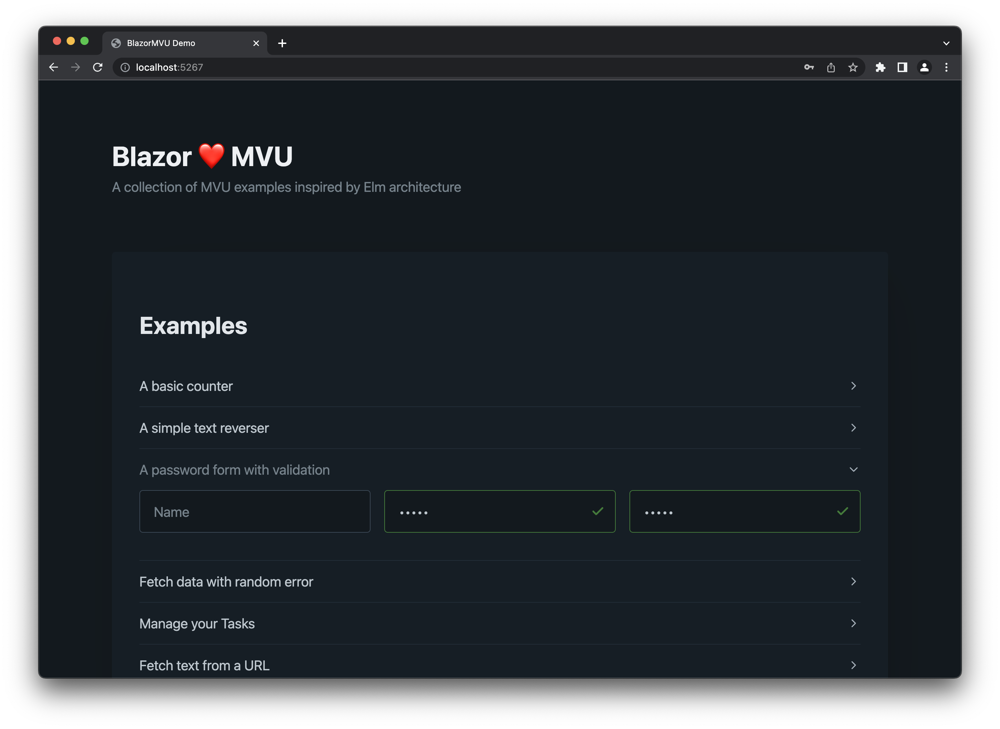

# BlazorMVU
A Model-View-Update (MVU) pattern implementation for Blazor.

---

[](https://github.com/Atypical-Consulting/BlazorMVU "Go to GitHub repo")
[](https://opensource.org/licenses/MIT)
[](https://github.com/Atypical-Consulting/BlazorMVU)
[](https://github.com/Atypical-Consulting/BlazorMVU)

[](https://github.com/Atypical-Consulting/BlazorMVU/releases/)
[](https://github.com/Atypical-Consulting/BlazorMVU/issues)
[](https://github.com/Atypical-Consulting/BlazorMVU/pulls)
[](https://github.com/Atypical-Consulting/BlazorMVU/graphs/contributors)
[](https://github.com/Atypical-Consulting/BlazorMVU/commits/master)

---

## 📝 Table of Contents

* [Introduction](#-introduction)
* [Motivation](#-motivation)
* [Features](#-features)
* [Installation](#-installation)
* [Usage](#-usage)
* [Running the Tests](#-running-the-tests)
* [Contributing](#-contributing)
* [License](#-license)
* [Contact](#-contact)
* [Acknowledgements](#-acknowledgements)
* [Contributors](#-contributors)

## 📖 Introduction

BlazorMvu is a library that implements the Model-View-Update (MVU) pattern for Blazor. It provides a structured way to organize your Blazor components and manage their state, making your code more understandable and easier to maintain.



## 💡 Motivation

The Elm architecture, or Model-View-Update (MVU), is a simple yet powerful pattern for structuring applications. It has gained popularity due to its simplicity, maintainability, and robustness. However, despite its advantages, the Elm architecture has not been widely adopted in the Blazor community.

Blazor, as a framework, is flexible and allows for various design patterns to be implemented, including MVU. However, there hasn't been a straightforward way to implement the Elm architecture in Blazor - until now.

The motivation behind BlazorMvu is to bring the benefits of the Elm architecture to the Blazor community. By providing a library that implements the MVU pattern, we aim to make it easier for developers to structure their Blazor applications in a way that is easy to understand, maintain, and test.

We believe that the Elm architecture can greatly improve the developer experience when building Blazor applications. By reducing the complexity associated with state management and UI updates, developers can focus more on the business logic of their applications, leading to more robust and reliable software.

We hope that BlazorMvu will serve as a valuable tool for the Blazor community and contribute to the growth and maturity of Blazor as a framework for building web applications.

## 📌 Features

* MVU pattern implementation for Blazor
* Demo components showcasing the usage of the library
* Unit tests using BUnit

## 📥 Installation

Clone the repository and build the project:

```bash
git clone https://github.com/Atypical-Consulting/BlazorMvu.git
cd BlazorMvu
dotnet build
```

## 📚 Usage

To use the BlazorMvu library, inherit from the `MvuComponent<TModel, TMsg>` class in your Blazor component. Define your model and messages, and implement the Init and Update methods.

```csharp
<!-- Counter.razor -->
@inherits MvuComponent<int, MvuCounter.Msg>

<div class="grid">
  <button class="btn btn-primary" @onclick="@(() => Dispatch(Msg.Decrement))">-</button>
  <input type="text" value="@State" disabled />
  <button class="btn btn-primary" @onclick="@(() => Dispatch(Msg.Increment))">+</button>
</div>

@code {
  
  // Messages
  public enum Msg
  {
    Increment,
    Decrement
  }

  // Initialize the model
  protected override int Init()
    => 0;

  // Update the model based on the message
  protected override int Update(Msg msg, int model)
    => msg switch
    {
      Msg.Increment => model + 1,
      Msg.Decrement => model - 1,
      _ => model
    };

}
```

## 🚀 Running the Tests

Tests are located in the `BlazorMvu.Tests project`. You can run them using the .NET Core CLI:

```bash
dotnet test
```

## 🤝 Contributing

Contributions are welcome! Please read the [CONTRIBUTION GUIDELINES](https://github.com/Atypical-Consulting/BlazorMVU/blob/main/CONTRIBUTING.md) first.

## 📜 License

This project is licensed under the terms of the MIT license. If you use this library in your project, please consider adding a link to this repository in your project's README.

This project is maintained by [Atypical Consulting](https://www.atypical.consulting/). If you need help with this project, please contact us from this repository by opening an issue.

## 📬 Contact

You can contact us by opening an issue on this repository.

## 🙌 Acknowledgements

* [All Contributors](../../contributors)
* [Atypical Consulting](https://www.atypical.consulting/)

## ✨ Contributors

[](http://contrib.rocks)